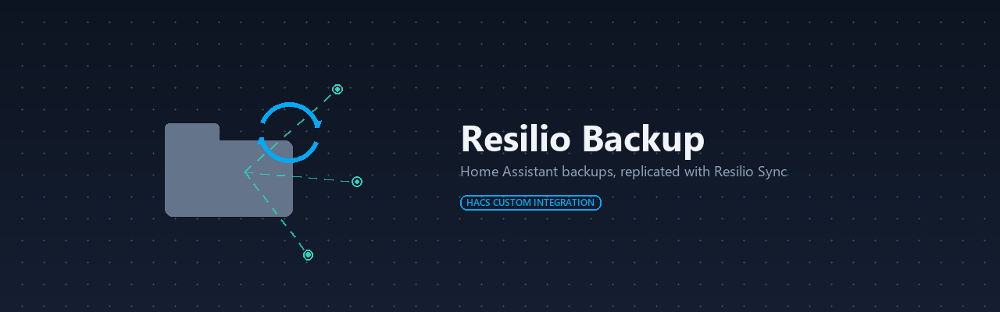

# Resilio Backup

`resilio_backup` exposes a [Resilio Sync](https://www.resilio.com/individuals/) managed folder as a Home Assistant backup location. Home Assistant writes the local backup files, Resilio Sync replicates them to peers, and the integration reports sync health back into Home Assistant.

> [!NOTE]
> This is a HACS integration, so it's not eligible for an official core [Integration Quality Scale](https://developers.home-assistant.io/docs/core/integration-quality-scale/) badge. The badge above is a self-assessment against that same checklist; see [`quality_scale.yaml`](custom_components/resilio_backup/quality_scale.yaml) for the rule-by-rule breakdown.

> [!WARNING]
> Resilio Sync is a third-party product. Use it at your own risk.

> [!NOTE]
> Non-English translations under [`translations`](custom_components/resilio_backup/translations) are AI-generated and may be inaccurate. Corrections via PR against the relevant locale file are welcome and appreciated, or [file a translation issue](../../issues/new?template=translation_bug.yml) if you'd rather flag it than fix it.

## Installation

### HACS

1. Open HACS.
2. Add this repository as a custom repository.
   - Category: `Integration`
3. Install `Resilio Backup`.
4. Restart Home Assistant.

### Manual

1. Copy `custom_components/resilio_backup` into your Home Assistant `custom_components` directory.
2. Restart Home Assistant.

## Before you start

The Resilio Sync agent must have its WebUI/HTTP API **enabled, network-reachable from Home
Assistant, and password-protected**. This isn't automatic on every install:

| Platform | HTTP API available | On by default | Default listen address |
| --- | --- | --- | --- |
| Linux / NAS builds | ✅ Yes | ✅ Yes (runs as a service) | `127.0.0.1` until `webui.listen` is set to a LAN address |
| Windows / macOS desktop apps | ✅ Yes | ❌ No — needs `webui.listen` set explicitly | `127.0.0.1` until `webui.listen` is set to a LAN address |
| iOS / Android apps | ❌ No | N/A | N/A — can't be used as the target for this integration |

On every platform the WebUI/HTTP API defaults to listening on `127.0.0.1`, so if the Resilio agent runs on a different machine than Home Assistant, `webui.listen` must be changed to a LAN address to be reachable.

## Setup

1. Open **Settings > Devices & services**.
2. Add **Resilio Backup**.
3. Enter:
   - `host`
   - `port`
   - `username`
   - `password`
   - `use_ssl`
   - `verify_ssl`
4. Pick an existing Resilio folder or choose **Create a new folder**.
5. Confirm `backup_path`.

`backup_path` is the filesystem path Home Assistant writes to. In the simple local case it matches the Resilio folder path. If the API is remote or reverse proxied, use the path the Home Assistant process can actually reach.

## Documentation

- [Usage](docs/usage.md): entities, automation examples, and options.
- [How it works](docs/how-it-works.md): backup format, the Resilio API this integration drives, and the standalone CLIs.
- [Troubleshooting](docs/troubleshooting.md): known limitations, common setup errors, and removing the integration.

