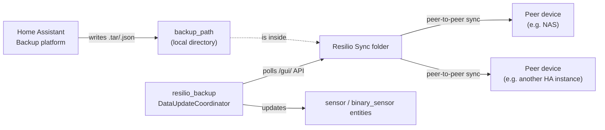

# How it works



> [!NOTE]
> This diagram renders on GitHub.com. HACS's in-app README viewer uses its own
> markdown renderer, which doesn't support Mermaid, so this block shows as
> plain text there instead of a rendered diagram — see the rest of this page
> for the same flow described in words.

Each backup uses two files in the configured directory:

- `<backup_id>.tar`
  - the raw Home Assistant backup archive
- `<backup_id>.json`
  - backup metadata that rebuilds the backup list without reopening the tarball

This integration only writes the local files, tracks metadata, applies retention, and reports status. Resilio Sync still handles the actual peer-to-peer transfer.

## Resilio's API

Resilio Sync's documented [`/api/v2`](https://github.com/bt-sync/sync_api_sample) REST API is gated behind a paid Business license; a free-tier install rejects it with an HTTP 400 and no body, confirmed against a live agent.

This integration instead drives the same undocumented `/gui/` endpoint the Sync WebUI itself uses: it mints a CSRF token from `/gui/token.html` (Basic Auth) plus the session cookie that comes back with it, then attaches both to every `action=` query call. That's the same approach taken by the reverse-engineered clients [`rslsync`](https://github.com/zhongkechen/python-resilio-sync-unofficial) and [`resilio-sync-cli`](https://github.com/PythonNut/resilio-sync-cli), which remain the only working references for this API; Resilio has never published it. [`resilio_client/client.py`](../custom_components/resilio_backup/resilio_client/client.py)'s `_async_fetch_token` and `_async_request` implement this, including a one-shot retry to remint the token if a session expires mid-use.

Every `/gui/` action response is a flat dict with a `status` field, where `200` means success; a non-200 status is a logical failure even on an HTTP 200 response.

## Standalone CLI

The Resilio WebUI client this integration talks to has no Home Assistant dependency; it lives in [`resilio_client/`](../custom_components/resilio_backup/resilio_client/) as its own installable package (nested under `custom_components/resilio_backup/` so the shipped integration folder stays self-contained for HACS/manual installs), with `custom_components/resilio_backup/api.py` as a thin wrapper that just supplies HA's shared `aiohttp` session. That split lets the same connection/folder logic run standalone, for manual testing or scripting against a Resilio Sync agent without a Home Assistant install:

```console
$ pip install -e .
$ resilio-client status --host localhost --port 8888 --username admin --password secret
$ resilio-client folders --host localhost --port 8888 --username admin --password secret
$ resilio-client add-folder --host localhost --port 8888 --username admin --password secret --path /mnt/sync/folders/backups
$ resilio-client share-link --host localhost --port 8888 --username admin --password secret --folder-id <id> --name backups
```

Every command prints its result as JSON on stdout. `--ssl`/`--no-verify-ssl` mirror the integration's `use_ssl`/`verify_ssl` options. CI (`resilio-client-e2e` in [`combined.yaml`](../.github/workflows/combined.yaml)) runs the `status`, `folders`, and `add-folder` commands against a real `resilio/sync` container on every PR, so the CLI (and the client it wraps) stay validated against Resilio's actual behavior, not just mocked responses.

The tar+json sidecar files this integration writes into that same folder are just as decoupled from Home Assistant: they live in [`resilio_backup_store/`](../custom_components/resilio_backup/resilio_backup_store/) (also nested under `custom_components/resilio_backup/` for the same reason), with `custom_components/resilio_backup/backup.py`'s `ResilioBackupAgent` as a thin wrapper that adds `AgentBackup` (de)serialization and Home Assistant's translated errors. `resilio-backup-store` drives the same list/create/restore/delete/prune logic directly against a directory, including one a live Resilio Sync agent is actually syncing:

```console
$ pip install -e .
$ resilio-backup-store create --backup-path /mnt/sync/folders/backups --backup-id b1 \
    --metadata '{"date": "2026-08-30T23:00:00+00:00"}' --input archive.tar
$ resilio-backup-store list --backup-path /mnt/sync/folders/backups
$ resilio-backup-store restore --backup-path /mnt/sync/folders/backups --backup-id b1 --output restored.tar
$ resilio-backup-store prune --backup-path /mnt/sync/folders/backups --max-backups 7
$ resilio-backup-store delete --backup-path /mnt/sync/folders/backups --backup-id b1
```

`--input`/`--output` accept `-` for stdin/stdout. Metadata is treated as an opaque JSON object; `backup_id` is always set from `--backup-id` regardless of what `--metadata` contains. CI (`backup-store-e2e` in [`combined.yaml`](../.github/workflows/combined.yaml)) runs a full create/list/restore/prune/delete round trip against a folder a real `resilio/sync` container manages, on every PR.
